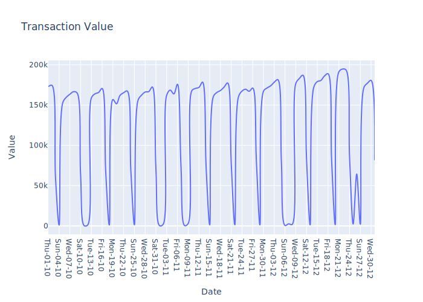
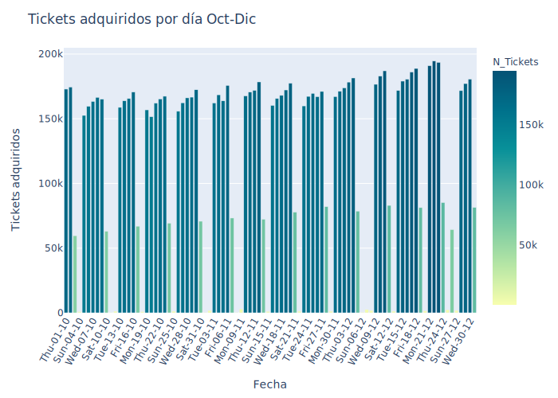
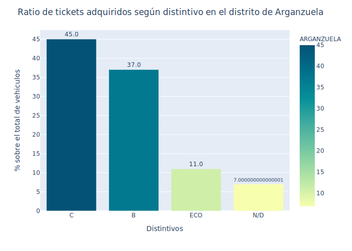
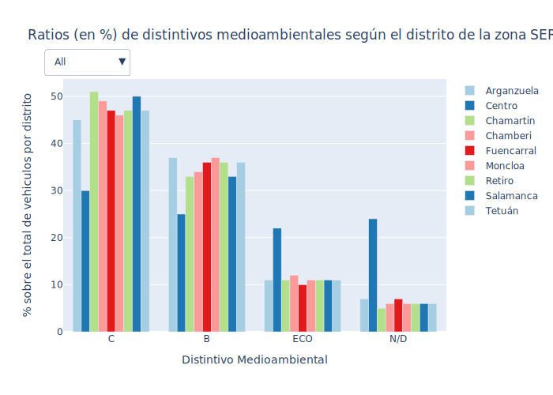

# Exploratory-Data-Analysis
This repository contains the results of some EDA projects done or in process...

Note: Unfortunately, there are some interactive Plotly figures that can not be rendered in this repo. 
To try solve this incident, a svg version is shared as a taste of what was already built.

If anyone seeing this project is interested in watching these interactive figures, please contact by mail at:
joseignacio.baciero.ds@immune.institute

# Proyecto 1: Exploratory Data Analysis (EDA) Zona SER Madrid

Bienvenidos a este Notebook, resultado de un proyecto con fines académicos, en el que analizo el estado actual, durante los meses de Octubre a Diciembre del pasado año 2020, de los hábitos de estacionamiento de los madrileños/as dentro de la Zona SER.

En algunas ocasiones podrá resultar la solución adoptada algo enrrevesada o poco intuitiva; esto es porque el objetivo no es otro que hacer uso de todos los recursos aprendidos hasta la fecha, independientemente de que hubiese un método más directo.

La fuente de los datos es la pagina estatal datos.gob.es y la dirección a los mismos se puede encontrar en el siguiente [enlace](https://datos.gob.es/es/catalogo/l01280796-servicio-de-estacionamiento-regulado-ser-tiques-de-aparcamiento)

## Preguntas a responder:

1. Series Temporales: Qué días de la semana son los que, en promedio, mayor cantidad de tickets de aparcamiento se adquiere
    1. Análisis de la evolución temporal de los tickets de aparcamiento adquiridos en función del día
    2. Gráficos en Matplotlib
    3. Gráficos en Plotly
        1. LinePlot
 
        2. BarPlot

2. En qué distrito hay más afluencia de coches (se sacan un mayor numero de tickets de aparcamiento)
   1. Barrio de mayor concurrencia de coches
    
3. Visualización: Qué tipo de distintivo es el que mayor uso hace de la zona SER (B,C,ECO..)
   1. Qué tipo de distintivo es el que mayor uso hace de la zona SER (B,C,ECO..)
   2. Qué barrio es el que mayor ratio de coches tiene distintivo C, B y ECO
       1. Gráficos Plotly:
           1. BarPlot 

           2. BarPlot con filtro

4. Diferencia entre tickets sacados por la aplicacion y en los parquimetros
    1. Gráfico de Seaborn: CatPlot
5. Zona en la que más tickets de aparcamiento se adquieren para la zona VERDE [mas se fastidia a los residentes]
    1. Distrito en el que más recauda la Zona Verde
6. Zona en la que se aparca por más tiempo
    1. Recaudación total, qué tipo de zona obtiene mayores ingresos
    
    
    

